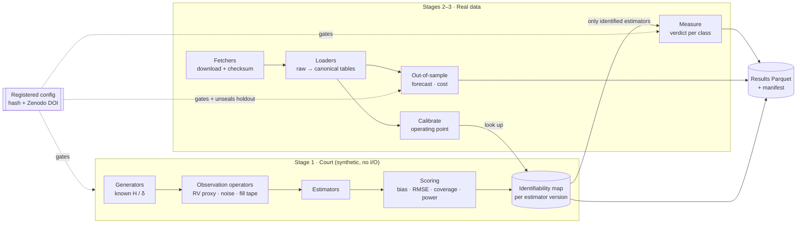

# Architecture

This is an outline of the system that [`proposal.md`](proposal.md) commits to. It is a design to build against, not a description of code that exists yet. Ordering is described in [`build-plan.md`](build-plan.md).

## The one idea the design rests on

**Estimators never see the truth; they see an observation of it.** Draft 1's two debates both come down to this. Cont and Das's argument is that the realised-variance *proxy* manufactures roughness. The impact question is whether the *metaorder reconstruction* manufactures a low exponent. So the domain models three things separately:

```
Truth  ──(generator)──▶  latent path  ──(observation operator)──▶  what an estimator sees  ──(estimator)──▶  Estimate
 H, δ                     spot vol,          RV proxy, noisy prices,                         value, interval,
                          metaorders         public fill tape                                 status
```

On synthetic data the truth is known, so the court scores the whole chain. On real data the observation is all there is, and the court's map says whether that chain is trustworthy at this dataset's operating point.

## Data flow



## Layers

Dependencies point inward: `cli → app → domain ← adapters`. The domain imports NumPy and SciPy and nothing else: no Polars, no file paths, no network, no clock.

| Layer | Holds | Must not |
| --- | --- | --- |
| `domain` | Typed truths and observations, generators, observation operators, estimators, scoring, forecasting models | Do I/O, read the clock, or use global RNG state |
| `ports` | `Protocol` interfaces: `RawSource`, `CanonicalLoader`, `ResultStore` | Contain logic |
| `adapters` | One fetcher + loader per source; Parquet result store; fakes for each port | Contain maths |
| `app` | Registration guard, court runner, calibration, measurement, out-of-sample pipelines | Run anything without a registered config |
| `cli` | `exponent court \| calibrate \| measure \| oos \| reproduce \| register` | Hold logic beyond argument parsing |

## Domain model

Sketches, not final signatures.

```python
# domain/types.py
class Estimand(Enum):
    H_LOG_SPOT_VOL = "H of log spot volatility"
    IMPACT_EXPONENT = "δ in I(Q) ∝ (Q/V)^δ"

@dataclass(frozen=True)
class Truth:                      # what the generator was told
    estimand: Estimand
    value: float
    params: Mapping[str, float]   # vol-of-vol, n, schedule mix, …

# Observation kinds an estimator can consume. Typed, so the court cannot
# feed an RV-based estimator a spot-vol path by mistake (Cont–Das's point).
@dataclass(frozen=True)
class SpotVolPath:  t: FloatArray; log_vol: FloatArray
@dataclass(frozen=True)
class PricePath:    t: FloatArray; log_price: FloatArray          # tick or fixed-grid
@dataclass(frozen=True)
class VolProxySeries: t: FloatArray; log_proxy: FloatArray; window: Timedelta; kind: ProxyKind
@dataclass(frozen=True)
class FillTape:     fills: FillArrays                              # address, side, size, price, ts, twap_id | None
@dataclass(frozen=True)
class Metaorders:   ...                                            # reconstructed or labelled

class Status(Enum):
    OK = "ok"; NO_ROOT = "no_root"; OUT_OF_RANGE = "out_of_range"; FAILED = "failed"

@dataclass(frozen=True)
class Estimate:
    status: Status                 # non-answers are outcomes, not NaN
    value: float | None
    native_ci: tuple[float, float] | None   # only if the method defines one
    diagnostics: Mapping[str, float]

@dataclass(frozen=True)
class EstimatorSpec:               # the registry entry; the leaderboard key is (name, version)
    name: str; version: str; citation: str
    consumes: type[Observation]; estimates: Estimand
    fn: Callable[[Observation, Params, np.random.Generator], Estimate]
```

**Generators** (`domain/generators/`):
- Fractional Gaussian noise by circulant embedding (Davies–Harte): exact and FFT-fast.
- RFSV (fractional OU log-vol), rough Bergomi (hybrid scheme), a semimartingale SV null, Guyon–Lekeufack path-dependent vol.
- A metaorder market: wallets run metaorders with a known impact law (power with δ, or logarithmic), uniform or U-shaped schedules, overlap, and sub-account splitting; a fraction are flagged as native TWAPs.

**Observation operators** (`domain/observe/`): RV, bipower and pre-averaged proxies at chosen windows; IID noise, Roll bid–ask bounce, tick rounding, path-dependent noise; the fill tape emitter, which strips parent ids except on TWAPs.

**Estimators** (`domain/estimators/`):
- Roughness: structure-function regression (GJR), normalised p-variation (Cont–Das), MF-DFA, GMM (Bolko et al.), quasi-likelihood/Whittle (Fukasawa et al.), pointwise H(t) (2606.25771).
- Impact: reconstruction heuristics (minimum child count, maximum gap, master-account aggregation) × fits (binned log-log, nonlinear least squares, logarithmic form, (η, F) surface).

**Scoring** (`domain/scoring/`): bias, RMSE, uniform parametric-bootstrap intervals and their coverage, native-interval coverage, power at fixed size, identifiability-map construction; QLIKE, Diebold–Mariano, Model Confidence Set.

## Invariants, and the lowest layer that enforces each

| Invariant | Enforced in | How |
| --- | --- | --- |
| Estimator only gets an observation kind it declares | domain | `EstimatorSpec.consumes` checked when a court cell is constructed; mismatch is a type error, not a runtime surprise |
| Every result is reproducible from its row | domain + app | RNG is `np.random.SeedSequence(entropy=config_hash, spawn_key=cell_id)`, so any cell reruns alone and in parallel with no global state |
| Non-answers are counted | domain | `Estimate.status`; scoring denominators include them |
| Nothing runs on an unregistered config | app | `Registration.load(path)` hashes the canonical YAML and compares it to `registry/index.yaml`; mismatch raises `UnregisteredConfig` |
| Holdout stays sealed | ports contract | Loaders take a `DataWindow` that carries sealed intervals and markets; reading them needs an `UnsealToken` that only a *final* registration can mint. One contract test suite runs against every adapter **and** every fake |
| Only identified estimators run on real data | app | `measure` looks up the dataset's calibrated operating point in the map and filters the registry; the excluded list is written to the results |
| Raw data is what we think it is | adapters | Fetchers verify SHA-256 against a committed manifest before a loader will open a file |

## Ports

```python
class RawSource(Protocol):           # network → local files
    def list(self, window: DataWindow) -> list[RemoteFile]: ...
    def fetch(self, f: RemoteFile, dest: Path) -> LocalFile: ...   # verifies checksum

class CanonicalLoader(Protocol):     # local files → canonical, typed tables
    def trades(self, window: DataWindow, unseal: UnsealToken | None = None) -> pl.DataFrame: ...
    def fills(self,  window: DataWindow, unseal: UnsealToken | None = None) -> pl.DataFrame: ...

class ResultStore(Protocol):
    def append(self, rows: ResultRows) -> None: ...
    def read(self, query: ResultQuery) -> pl.DataFrame: ...
```

Draft 1 had a single `DataSource` (fetch, verify, return a frame). It is split because downloading happens once and analysis happens many times; folding them together puts the network on the path of every test.

Canonical schemas live in `adapters/schemas.py` (Polars). The domain receives NumPy arrays wrapped in the observation types above, never DataFrames.

## Provenance

Every result row carries: `config_hash`, `registration_doi`, `git_commit`, `estimator_name`, `estimator_version`, `cell_id`, `seed_spawn_key`, `data_manifest_hash` (real data only), `status`, `value`, intervals, and diagnostics. `exponent reproduce <figure>` re-derives a figure from rows alone. Results are git-ignored Parquet with a hashed manifest that is committed.

## Quality gates

- **Unit tests** for every generator and estimator. Generators are checked against closed-form moments, e.g. that fGn's empirical autocovariance matches theory within Monte Carlo error.
- **Property tests** (Hypothesis) for estimator invariants: H unchanged by adding a constant to log-vol or rescaling time units; δ unchanged by rescaling notional and volume together; output is deterministic given the seed.
- **Known-answer tests**: the M0a reproductions become permanent regression tests, at small n, with tolerances derived from their Monte Carlo standard error rather than picked by hand.
- **Adapter contract tests**: one suite run against fakes on every push and against real sources nightly. This includes the sealed-holdout test.
- **Static analysis**: `ruff`, and `mypy --strict` on `domain` and `app`. Adapters too: that is where unit tests do not reach.
- **CI on push**: format, lint, type-check, tests, and a smoke court (a tiny grid that must reproduce a known number). The nightly job adds the network contract tests.

## Technology

| Part | Choice | Note |
| --- | --- | --- |
| Language | Python 3.12 | |
| Numerics | NumPy, SciPy | Numba only when profiling demands it; FFT-based generators may make it unnecessary |
| Tables | Polars + Parquet (pyarrow) | DuckDB dropped: one columnar tool is enough |
| Configs | YAML validated by Pydantic | Canonicalised (sorted keys, normalised floats) before hashing, so whitespace edits do not change the hash |
| Registration | GitHub release → Zenodo DOI | External timestamp; commit dates are author-controlled |
| Environment | uv + lockfile | |
| Quality | pytest, Hypothesis, ruff, mypy | |
| CI | GitHub Actions | |
| Paper and site | Quarto; static leaderboard | Deferred until the first verdict |

## Repository layout

```
src/exponent/
  domain/
    types.py  rng.py
    generators/    fgn.py rfsv.py rbergomi.py sv_null.py path_dependent.py metaorder_market.py
    observe/       proxies.py noise.py fill_tape.py
    estimators/    registry.py
      roughness/   structure_function.py pvariation.py mfdfa.py gmm.py whittle.py pointwise.py
      impact/      reconstruct.py fit.py
    scoring/       errors.py intervals.py power.py idmap.py forecast.py
    models/        har.py rfsv_forecast.py path_dependent.py
  ports/           sources.py store.py window.py
  adapters/
    binance/ hyperliquid/ polymarket_v1/ cboe/ deribit/
    parquet_store.py  schemas.py
    fakes/
  app/             registration.py court.py calibrate.py measure.py oos.py
  cli/             main.py
registry/          index.yaml + one dated YAML per registration
manifests/         SHA-256 manifests per data source
results/           git-ignored Parquet + committed manifest
paper/  site/      (later)
tests/
  unit/ property/ known_answer/ contract/ e2e/
```
