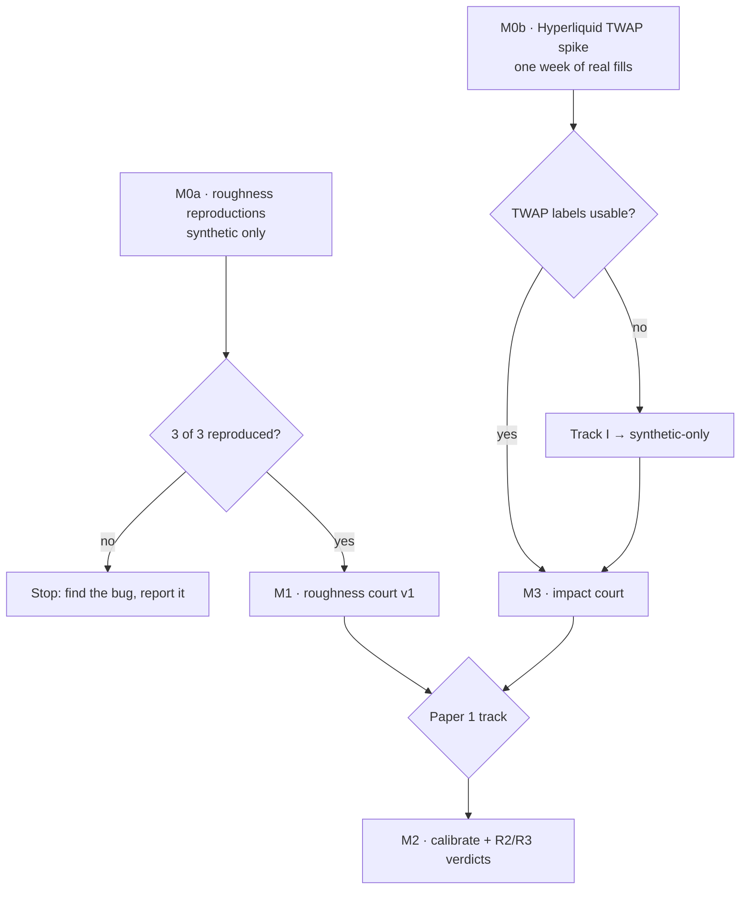

# Proposed build

How I would build [`architecture.md`](architecture.md), in order of risk. Nothing here is built yet. This is the proposal to approve or redirect.

## Principle

The first thing built is the thing most likely to prove the project wrong. Two questions qualify, one per track, and both are cheap to answer:

1. **Can our harness reproduce what is already known?** If it cannot reproduce three published roughness results on synthetic data, every later verdict is suspect, and we find that out before touching real data.
2. **Does the impact track's novel angle exist in the data?** The proposal now leans on Hyperliquid's native TWAPs being identifiable in public fills. If they are not, Track I loses its real-data ground truth, and we should know that in week one, not month three.

So M0 is two spikes that can run in parallel. Everything else waits on their gates.

## M0a — roughness reproductions (synthetic only)

**Builds:** the repo skeleton plus the smallest slice of the domain that can reproduce three known results.

| Piece | Content |
| --- | --- |
| Skeleton | `pyproject.toml` (uv), ruff, mypy, pytest, Hypothesis, GitHub Actions running all of them |
| `domain/types.py`, `rng.py` | Observation types, `Estimate` with `Status`, seed-sequence helper |
| `generators/` | fGn (Davies–Harte), RFSV log-vol, fractional log-vol with H > 0.5, semimartingale SV null, rough Bergomi (hybrid scheme) |
| `observe/proxies.py` | Intraday price simulation given vol; daily RV from k intraday returns |
| `estimators/roughness/` | Structure-function regression; normalised p-variation; MF-DFA |
| `app/court.py` | Minimal grid runner: truth × observation × estimator × seeds → Parquet rows |
| `tests/known_answer/` | The three reproductions below, at small n, as permanent regression tests |

**Reproductions (the gate):**

1. **GJR recovery.** RFSV with H = 0.1, estimator applied to *spot* log-vol. The structure-function estimate recovers H within ±2 Monte Carlo standard errors.
2. **Cont–Das artefact.** Smooth fractional log-vol (H > 0.5), observed through daily RV. The structure-function estimate lands far below the true H, matching their reported magnitude within Monte Carlo error.
3. **Lumor non-identification.** Rough Bergomi at their calibrated vol-of-vol (η ≈ 1.5+), daily RV. Our three estimators reproduce their "non-identified / undefined / out of range" outcomes at the same grid points, cross-checked against their released code.

**Gate:** all three reproduced. If any fails, stop, find out whether the bug is ours or theirs, and report it. A discrepancy with a published paper is itself a finding.

**Deliberately absent:** registration guard, adapters, holdouts, Numba, leaderboard. Registration is not chassis here — it is core to the project's credibility — but it only matters once real data is involved, and M0a touches none. It lands in M1, before the first real-data read.

**Rough size:** 3–5 working sessions. The rough-Bergomi hybrid scheme is the fiddliest part.

## M0b — Hyperliquid TWAP spike (real data, throwaway code)

A notebook-grade script in `spikes/`, deleted or promoted after the gate. It does not go through the architecture, because its job is to answer a yes/no question fast.

1. Pull one week of `node_fills_by_block` for BTC, ETH and one thin market. That is a few GB; requester-pays egress is cents to a dollar, or use a free mirror and check it against the official bucket.
2. Establish whether public fills identify native TWAP slices and their parent. **This is the single most important unknown in the proposal.**
3. Reconstruct metaorders with Barone and Lillo's rule (same address, same side, ≥ 10 child orders, gap threshold), hide the TWAP labels, and measure precision and recall against them.
4. Plot naive impact curves for labelled TWAPs vs reconstructed metaorders.

**Gate:** TWAP parents are recoverable from public data, with enough of them (target: thousands of labelled metaorders per month) for I1 to have power. If not, Track I continues on synthetic validation only and the proposal's "why now" for the impact track weakens. That is worth knowing before choosing paper 1's track.

**Rough size:** 2–3 sessions.

## After M0

| Milestone | Builds | Gate |
| --- | --- | --- |
| M1 · roughness court v1 | GMM, Whittle and pointwise estimators; noise models; uniform bootstrap intervals; power; identifiability maps; dev/test grid split; **registration guard + first Zenodo registration** | Maps stable across seeds; harness preprint; invite review from both camps |
| M2 · real roughness | Binance and CBOE/Deribit adapters with contract tests; `calibrate`; sealed-holdout loader; R2 verdicts; HAR/RFSV/GL forecasting with QLIKE and MCS (R3) | Holdout opened once; paper 1 submitted (if roughness leads) |
| M3 · impact court | Metaorder-market generator; reconstruction × fit grid; Hyperliquid adapter; TWAP-label scoring; power vs log forms; I2 verdict | Validated pipeline exists, or "undecidable" is reported |
| M4 · Polymarket | Only after the I3 literature check | — |
| Later | Leaderboard site, Quarto paper build, Numba if profiling asks | Earned by a shipped verdict |

## What I need from you before starting

1. **Approve M0a + M0b as the first build.** M0a goes on this branch as the first code PR; M0b as a throwaway spike.
2. **Paper 1 track.** I recommend deferring the choice until M0 is done, leaning impact if M0b's gate passes, because the roughness audit is partly scooped and the TWAP-labelled audit appears new.
3. **Hyperliquid access** for M0b: the official requester-pays bucket (needs an AWS account; costs cents) or a free mirror.
4. **Licence**: MIT for code, CC BY for results — confirm.

## What this plan does not promise

- No effort estimate past M0. Sizes above are rough guesses to be corrected by M0.
- Citations marked "still to verify" in [`review.md`](review.md) get checked before any public text, not before M0 code.
- Nothing here has been run. No code exists yet.
